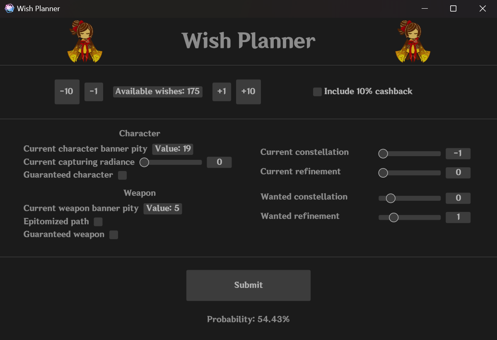

# Wish Planner
A wish simulator with a simple interface to compute probabilities of success.



# Installation
Just [download](https://github.com/Tijoxa/wish/releases) and run the latest `.exe` file. No installation required.

To build from source, install [Rust](https://www.rust-lang.org/) then build the application in release mode:
```Bash
cargo build --release
```

# Web
## Wasm
setup wasm-pack: https://rustwasm.github.io/docs/wasm-pack/introduction.html

for local, run
```Bash
wasm-pack build --release --target web --no-pack; uv run python -m http.server --bind 127.0.0.1 8000
```
